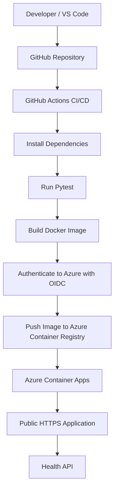

# ☁️ CloudOps Health Dashboard

[](https://github.com/vinnu2g/cloudops-health-dashboard/actions)

A containerized Python Flask application deployed on **Microsoft Azure** with a fully automated **CI/CD pipeline using GitHub Actions**.

This project demonstrates a practical end-to-end Cloud/DevOps workflow including automated testing, Docker containerization, secure OIDC authentication, Azure Container Registry, managed identities, and automatic deployment to Azure Container Apps.

---

## 🚀 Live Demo

### CloudOps Dashboard

👉 [Open Live Application](https://cloudops-dashboard.agreeablebeach-76ddc4fa.centralindia.azurecontainerapps.io)

### Health Check API

👉 [Open Health Endpoint](https://cloudops-dashboard.agreeablebeach-76ddc4fa.centralindia.azurecontainerapps.io/health)

Expected response:

```json
{
  "service": "cloudops-dashboard",
  "status": "healthy"
}
```

---

## 📌 Project Overview

The **CloudOps Health Dashboard** is a lightweight cloud-native web application created to demonstrate how a simple Python application can move through a real DevOps lifecycle.

The project includes:

- Flask web application
- REST health-check API
- Docker containerization
- Gunicorn production server
- Automated testing using Pytest
- Git version control
- GitHub repository
- GitHub Actions CI/CD
- Azure Container Registry
- Azure Container Apps
- Azure Managed Identity
- Azure RBAC
- GitHub-to-Azure authentication using OIDC
- Automated cloud deployment
- Public HTTPS endpoint

---

## 🏗️ Architecture



### Deployment Flow

```text
Developer
   ↓
Git Push
   ↓
GitHub Repository
   ↓
GitHub Actions
   ↓
Automated Tests
   ↓
Docker Image Build
   ↓
OIDC Authentication
   ↓
Azure Container Registry
   ↓
Azure Container Apps
   ↓
Public HTTPS Application
```

---

## 🛠️ Technology Stack

| Category | Technology |
|---|---|
| Programming | Python 3.11 |
| Web Framework | Flask |
| Production Server | Gunicorn |
| Testing | Pytest |
| Containerization | Docker |
| Version Control | Git |
| Repository | GitHub |
| CI/CD | GitHub Actions |
| Cloud Platform | Microsoft Azure |
| Container Registry | Azure Container Registry |
| Deployment Platform | Azure Container Apps |
| Authentication | OpenID Connect (OIDC) |
| Identity | Azure Managed Identity |
| Access Control | Azure RBAC |

---

## 🔄 CI/CD Pipeline

Every push to the `main` branch automatically triggers the GitHub Actions pipeline.

The pipeline performs:

```text
1. Checkout source code
2. Configure Python 3.11
3. Install dependencies
4. Run automated Pytest tests
5. Build the Docker image
6. Authenticate to Microsoft Azure using OIDC
7. Login to Azure Container Registry
8. Tag the Docker image using the Git commit SHA
9. Push the image to Azure Container Registry
10. Update the Azure Container App
11. Azure creates a new application revision
12. The latest version becomes available through HTTPS
```

Therefore, the deployment workflow is:

```text
Edit Code
   ↓
git add
   ↓
git commit
   ↓
git push
   ↓
GitHub Actions
   ↓
Test
   ↓
Build
   ↓
Push
   ↓
Deploy
```

No manual Azure deployment is required after pushing code to GitHub.

---

## 🐳 Docker

The application runs inside a Docker container.

```dockerfile
FROM python:3.11-slim

WORKDIR /app

COPY requirements.txt .

RUN pip install --no-cache-dir -r requirements.txt

COPY . .

EXPOSE 5000

CMD ["gunicorn", "--bind", "0.0.0.0:5000", "app:app"]
```

Gunicorn is used as the production WSGI server instead of Flask's development server.

---

## ☁️ Microsoft Azure Architecture

### Azure Container Registry

The application's Docker images are stored in a private **Azure Container Registry**.

Repository:

```text
cloudops-dashboard
```

Each CI/CD deployment creates an image tagged with the Git commit SHA for traceability.

---

### Azure Container Apps

The application runs using **Azure Container Apps**.

Configuration:

```text
Region: Central India
Ingress: External
Protocol: HTTP/HTTPS
Target Port: 5000
Workload Profile: Consumption
```

Azure automatically provides a secure HTTPS endpoint for the application.

---

## 🔐 Cloud Security

The project follows several cloud security practices.

### GitHub → Azure

GitHub Actions authenticates to Azure using:

```text
OpenID Connect (OIDC)
```

This avoids storing long-lived Azure passwords or client secrets in GitHub.

A dedicated deployment identity is used:

```text
github-deploy-id
```

---

### Azure Container Apps → Container Registry

Azure Container Apps uses a dedicated managed identity:

```text
cloudops-pull-id
```

This identity has only:

```text
AcrPull
```

permission to retrieve container images from Azure Container Registry.

This separates deployment permissions from runtime image-pull permissions.

---

## ❤️ Health Check API

The application exposes:

```text
GET /health
```

Example response:

```json
{
  "service": "cloudops-dashboard",
  "status": "healthy"
}
```

Health endpoints are commonly used by:

- Load balancers
- Kubernetes
- Container orchestrators
- Monitoring tools
- Uptime monitoring systems
- Cloud platforms

---

## 🧪 Automated Testing

Pytest automatically tests the health endpoint.

Example:

```python
from app import app

def test_health():
    client = app.test_client()

    response = client.get("/health")

    assert response.status_code == 200
    assert response.get_json()["status"] == "healthy"
```

The test must pass before the CI/CD workflow proceeds with deployment.

---

## 📁 Project Structure

```text
cloudops-health-dashboard/
│
├── .github/
│   └── workflows/
│       └── ci.yml
│
├── templates/
│   └── index.html
│
├── tests/
│   └── test_app.py
│
├── .gitignore
├── app.py
├── Dockerfile
├── requirements.txt
└── README.md
```

---

## 💻 Run Locally

Clone the repository:

```bash
git clone https://github.com/vinnu2g/cloudops-health-dashboard.git
```

Move into the directory:

```bash
cd cloudops-health-dashboard
```

Install dependencies:

```bash
python -m pip install -r requirements.txt
```

Run the application:

```bash
python app.py
```

Open:

```text
http://127.0.0.1:5000
```

Health API:

```text
http://127.0.0.1:5000/health
```

---

## 🐳 Run Using Docker

Build the image:

```bash
docker build -t cloudops-dashboard .
```

Run the container:

```bash
docker run -p 5000:5000 cloudops-dashboard
```

Open:

```text
http://127.0.0.1:5000
```

---

## 🧪 Run Tests

Run:

```bash
python -m pytest
```

Expected result:

```text
1 passed
```

---

## 📦 Container Versioning

GitHub Actions tags production Docker images using the Git commit SHA.

Example:

```text
cloudops-dashboard:<git-commit-sha>
```

This provides traceability between:

```text
Git Commit
    ↓
Docker Image
    ↓
Azure Revision
```

This helps identify exactly which source-code version is running in production.

---

## 🔒 Security Practices

The project demonstrates:

- OIDC-based cloud authentication
- No Azure passwords stored in GitHub
- No long-lived Azure deployment secrets
- Private Azure Container Registry
- Azure Managed Identity
- Azure Role-Based Access Control
- Dedicated image-pull identity
- Dedicated deployment identity
- HTTPS ingress
- `.gitignore` for local/private files
- Automated testing before deployment

---

## 🎯 Skills Demonstrated

### Cloud Engineering

- Microsoft Azure
- Azure Container Registry
- Azure Container Apps
- Azure Managed Identity
- Azure RBAC
- Azure CLI

### DevOps

- CI/CD
- GitHub Actions
- Git
- GitHub
- Automated deployments
- Container image lifecycle
- Deployment troubleshooting

### Containers

- Docker
- Dockerfile
- Image building
- Image tagging
- Private container registry
- Production container deployment

### Development

- Python
- Flask
- REST API
- Gunicorn
- Pytest

### Cloud Security

- OpenID Connect
- Managed Identity
- Role-Based Access Control
- Secretless authentication
- Least-privilege image access

---

## 📚 What I Learned

Through this project I learned the practical lifecycle of a cloud-native application:

```text
Develop
   ↓
Test
   ↓
Containerize
   ↓
Build
   ↓
Version
   ↓
Publish
   ↓
Deploy
   ↓
Operate
```

I also gained hands-on experience troubleshooting:

- Python environments
- Flask networking
- Docker builds
- Docker port mapping
- Git authentication
- GitHub Actions YAML
- GitHub Actions failures
- Azure CLI
- Azure Container Registry
- Azure Container Apps
- Managed identities
- Azure RBAC
- OIDC authentication
- Container image permissions
- Azure deployment errors
- CI/CD automation

---

## 🔮 Future Improvements

Future versions can include:

- Azure Monitor
- Application Insights
- Structured logging
- CPU and memory monitoring
- Container health probes
- Automated rollback
- Staging and production environments
- Terraform Infrastructure as Code
- Security scanning
- Docker image vulnerability scanning
- Custom domain
- Prometheus
- Grafana
- Kubernetes deployment using AKS

---

## 🎓 Project Purpose

This project was developed as a practical **Cloud/DevOps portfolio project**.

The objective was to transform a simple Python application into a:

```text
Containerized
+
Tested
+
Securely Authenticated
+
Automatically Deployed
+
Cloud-Hosted Application
```

using modern Cloud and DevOps practices.

---

## 👨‍💻 Author

**Vinayak S Gobbi**

M.Tech — Digital Communication & Networking (DCN)  
REVA University  
Bengaluru, India

### Areas of Interest

- Cloud Engineering
- DevOps
- Kubernetes
- Microsoft Azure
- AWS
- Infrastructure Automation
- Cloud Security
- AI for Cloud Operations

### GitHub

https://github.com/vinnu2g

---

## 📄 License

This project is currently developed for educational, learning, and portfolio purposes.